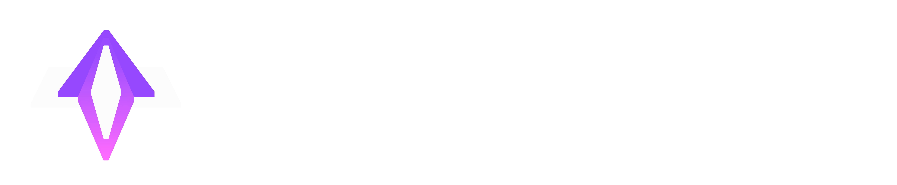

# 

**Fireworks** is a sdk and framework developed for the creation 
of 3d graphic programs such as games and simulations.

It is inspired by Flutter and focuses to provide a pleasant developer experience just as good.
With Fireworks, you can create games and other 3d real-time applications for desktop and mobile.
The sdk is available for desktop.

Just like the most engines, Fireworks is free of charge as long you are non-commercial. 
Otherwise, you have to get a commercial license that forces you to pay 5% of your revenue once it exceeds 10 000$.

# Overview of engine runtime steps
1. Create the core systems, entry point and application layer as well as launch the first window.
2. Write the basics such as dynamic arrays and strings.
3. Plan a memory and thread subsystem.
4. Start with the render surface to make at first the nuklear ui functional and allow to build debug interfaces in c.
5. Build test pipeline for supported platforms on ci.
6. Create math lib with vectors and matrix multiplication.
7. Start with the first basic 3d rendering of cube (Remember cubes must be reinstanceable to test the dart interaction module).
8. Calm down and remember what to refector.
9. Write the physics module.
10. Combine the renderer and physics module to see the first impulses.
11. Design a consistent way if representing the actual 3d space in code.
12. Implement 3d spatial sounds.
13. Check to ensure the modules runs multithreaded and performant.
14. Implement the Dart logic interaction layer, which should be a subsystem on its own, that creates a queue for rendering its entities, play audio, send information through network, bring the information of the network in the dart layer, send native calls for platform application and push this queue async on their implemented interfaces on their threads.
15. Calm down after the hard steps and remember to refector a bunch.
16. Now its time to test the extensibility of the dart interaction by working further on the renderer.
17. Furthermore an asset manager would be required to load assets. Also its implementation in the Dart Engine Interaction Layer (Ill call it from now on DEIL)
18. The engine renderer must use shaders, so a loader and its infrastructure is required.
19. Dart must be able to take advantage of the shader loading so an api for DEIL is required.
20. Heavy optimizing should be done for DEIL and its connection to ensure the quality.
21. Remember to refector again because the current time is hard.
22. Build a stable interface for the C language.
23. Implement advanced render techniques such as ambient occlusion, screen space reflections, global illumination, lod loader and its transitions, materials and post processing. Ensure these feature pipelines are open to add also via DEIL.
24. Implement water shaders, and 2d rendering on planes.
25. Dart api: Create a state machine, flipbooks and 2d animations to display complex 2d entities.
26. Add configuration to graphics pipeline to allow changing the general render appearance and disable feature for support lower end devices.
27. Now it should be time to add ui debug capabilites to dart, so an ui abstraction to the DEIL and a new ui thread module should be created.
28. A 3d skeleton that allows to attach meshes and components such as entities to it should be implemented. C & DEIL
29. A good math lib should also be in dart. (Remember to used unboxed variables)
30. Calm down and refector a much of the old garbage.
31. Integrate debugging tools for performance monitoring of the frame times.
32. Optimize frame times.
33. Implement material properties for reflection surfaces, roughness, texture, height map for lighting, height map for tesselate the shit.
34. Furthermore the post processing should be available in dart.
35. Ensure multiple window support.
36. Ensure platform support.
37. Ensure quality and frame times.
38. Make the state machine available for multiple purposes.
39. Add features for the state machine for extensive use in multiple scenarios.
40. Add AI behaviour and pathfindig, line of sight etc. algorithms.
41. Port over to DEIL.
42. Refector a bunch.

Finished up the first chapter of fireworks

# Overview of the runner and its steps

> Note that the runner brings the pkgs together.
> In this way there will be less dependencies between them. Builder, Analyzer.. these are pkgs.
1. Start off with implement the builder wich can compile c code and uses gen_snapshots of dart for dart cross compilation.
2. Enable hot reloading the c code by replacing the applications shared lib at runtime while dev cycle.
3. Write the project analyzer for containing the peoject information that the builder will later get as well as debugging puproses and data processing for its representation in fancy uis. Source code classes must be analyzed for the dependency graph in the editor.
5. Internally the runner should host an http where requests can receive data with the analyzer about the project and can send data to perform actions on the project. Its the main interface for the project runner dev cycle where many tools for creating, viewing and manage dependencies and assets will come together. For maximizing modularity.
6. Implement the dart ecosystem toolchain, an c package manager, a vcs manager, a deps version manager, a debug manager, a http backend host management toolchain, language serialization and parsing.
7. Refector that shit to make it more acceptable.
8. Create a second http server with a static port to host the editor which is a web app.
   It should receive paths as well as the port of the project server and then pushes these web paths over as arguments to the hosted web app.

# Overview for the editor tooling
1. Import the widgets of old projects.
2. Refector a bit.

**Needs more planning then**
3. Create a good main class responsible to start up by receiving the http port and paths via
   cmdline.

4. Call the project server http interface based on widget requests to show up properly the right data and tooling. The state of one widget must be saved in the web host server provided by the runner which also provides a backend for the web application that can be opened multiple times.
5. The business logic goes for animation and responses in to the web app and for application state in the web host server backend.
   6..... Furthermore it needs to be a bit further with runtime and the runner.

# Engine Development Roadmap

### 1. Core Systems & Infrastructure

1. Implement die Kernsysteme, den Entry Point und die Applikationsschicht. Starte das erste Fenster.

2. Entwickle grundlegende Datenstrukturen wie dynamische Arrays und Strings.

3. Plane das Speicher- und Thread-Subsystem.

4. Implementiere eine Rendering-Oberfläche, um Nuklear UI funktional zu machen und Debug-Interfaces in C zu ermöglichen.

5. Erstelle eine Test-Pipeline für unterstützte Plattformen auf CI.

6. Entwickle eine Mathe-Bibliothek mit Vektoren und Matrizenmultiplikation.

### 2. Erste Visualisierung & Physik

1. Implementiere das erste einfache 3D-Rendering eines Würfels (mit Wiederverwendbarkeit zur Testung des Dart-Interaktionsmoduls).

2. Review und Refactoring der bisherigen Schritte.

3. Entwickle das Physikmodul.

4. Kombiniere Renderer und Physikmodul, um erste Impulse sichtbar zu machen.

5. Definiere eine konsistente Repräsentation des 3D-Raums im Code.

6. Implementiere 3D-Spatial-Sound.

7. Optimiere die Module für Multithreading und Performance.

### 3. Dart Interaktionsschicht (DEIL) & Erweiterbarkeit

1. Implementiere die Dart-Interaktionsschicht (DEIL) als eigenes Subsystem mit einer asynchronen Queue für Rendering, Audio, Netzwerk und native Calls.

2. Review und weiteres Refactoring.

3. Teste die Erweiterbarkeit der Dart-Interaktion durch Weiterentwicklung des Renderers.

4. Implementiere einen Asset-Manager und dessen Integration in DEIL.

5. Implementiere Shader-Support mit einem Loader und entsprechender Infrastruktur.

6. Erstelle eine API für DEIL, um Shadersysteme zu nutzen.

7. Optimiere DEIL und seine Verbindungen zur Engine.

8. Refactoring zur Stabilisierung der aktuellen Fortschritte.

10. Baue eine stabile C-Schnittstelle.

### 4. Erweiterte Rendering-Techniken

1. Implementiere fortgeschrittene Rendering-Techniken:

2. Ambient Occlusion

3. Screen Space Reflections

4. Global Illumination

5. LOD-Management und Übergänge

6. Materialsysteme

7. Post-Processing (erweiterbar über DEIL)

8. Implementiere Wassershaders und 2D-Rendering auf Planes.

9.  in Dart ein State Machine System sowie Flipbooks und 2D-Animationen.

10. Implementiere Konfigurationsoptionen für die Renderpipeline zur Anpassung der Performance für Low-End-Geräte.

### 5. UI & Debugging

1. Implementiere eine UI-Abstraktion für DEIL und ein dediziertes UI-Thread-Modul.

2. Entwickle ein 3D-Skelettsystem zur Befestigung von Meshes und Entitäten.

3. Implementiere eine optimierte Mathe-Bibliothek in Dart (mit Unboxed Variablen).

4. Weiteres Refactoring.

5. Integriere Debugging-Tools zur Performance-Analyse der Frame-Times.

6. Optimiere die Frame-Times.

### 6. Finalisierung & Erweiterungen

1. Implementiere Materialeigenschaften für Reflexion, Roughness, Texturen, Height Maps für Beleuchtung und Tessellation.

2. Stelle Post-Processing über DEIL zur Verfügung.

3. Implementiere Multi-Window-Support.

4.  der Plattformunterstützung.

5. Performance- und Stabilitätsoptimierung.

6. Erweitere die State Machine für allgemeine Nutzungsszenarien.

7. Implementiere KI-Algorithmen wie Pfadfindung und Sichtfeldberechnungen.

8. Portiere KI-Features auf DEIL.

9. Letztes großes Refactoring.

# Runner Development Roadmap

### 1. Basisfunktionen

1. Implementiere den Builder für C-Kompilierung und Dart-Cross-Kompilation.

2. Ermögliche Hot-Reloading von C-Code durch Austausch der Shared Library zur Laufzeit.

3. Entwickle den Projekt-Analyzer zur Extraktion von Projektinformationen für den Builder, Debugging und UI-Darstellung.

4. Implementiere einen internen HTTP-Server zur Bereitstellung von Projektinformationen und Steuerung von Abläufen.

5. Entwickle einen modularen Toolchain-Support für:

6. Dart-Toolchain-Integration

7. C-Paketmanager

8. VCS-Manager

9. Versions- und Abhängigkeitsverwaltung

10. Debugging-Management

11. HTTP-Backend-Management

13. Sprachserialisierung und Parsing

14. Refactoring der Struktur und Code-Qualität.

15. Implementiere einen zweiten HTTP-Server mit statischem Port für das Hosting des Editors als Web-App.

# Editor Tooling Roadmap

### 1. Grundlegende Infrastruktur

1. Importiere Widgets aus alten Projekten.

2. Initiales Refactoring der Struktur.

### 2. Implementierung

1. Entwickle eine zentrale Startklasse, die HTTP-Port und Projektpfade per Kommandozeile erhält.

2. Integriere eine API zur Kommunikation mit dem Projektserver für Widget-Daten und Tools.

3. Implementiere eine persistente Speicherung des Widget-States über den Webhost-Server.

4. Trenne Business-Logik von UI-Interaktionen:

5. Animation und Reaktionen im Web-Client

6. Applikationsstatus im Webhost-Backend

### 3. Weiterentwicklung

* Weitere Planung und Iteration in Abhängigkeit vom Entwicklungsstand des Runners.